```{r setup, include=FALSE}
knitr::opts_chunk$set(echo = TRUE)
```

\newpage

# Introducción

Un "shell" es una interfaz de usuario que permite la interacción con un sistema operativo a través de comandos. En este caso, vamos a desarrollar un shell sencillo en C que pueda ejecutar comandos básicos del sistema operativo.

- **Sofía Travieso García**: se encargó del desarrollo del código general y del apartado opcional"calcular el tiempo que tarda en ejecutarse el proceso hijo". Además, se encargó de realizar la última versión del documento.

- **Daniel Rodríguez Alonso**: se encargó del desarrollo del código general y de la creación del cursor ":) / :(" del código. Además, elaboró la primera versión del documento.

- **Jaime Rivero Santana** se encargó del desarrollo del código general y del apartado opcional "cambiar el directorio con cd".

# Flujo de Ejecución

Para el desarrollo de este shell tenemos que tener en cuenta el flujo de ejecución de nuestro programa, que será el siguiente:

{width=45%}

# Conceptos para crear un Shell

## Process ID (PID)

El PID es una abreviatura del process ID, es decir, del ID del proceso o **identificador del procesos**. El identificador de procesos es un número entero usado por el Kernel de algunos sistemas operativos (como el de **Unix** o el de **Windows NT**) para identificar un proceso de forma unívoca.

Mostramos un código ejemplo para que se vea como se obtiene el PID en C:

```{c, eval=FALSE}
#include <stdio.h>
#include <unistd.h>
#include <sys/types.h>

int main()
{
    pid_t pid;
    int a = 3;
    int b = 5;
    int sum = a + b;

    pid = getpid();

    printf("El PID es %d\n", pid);
    printf("La suma es %d\n", sum);

    return 0;
}
```

Este es un pequeño código que imprime una suma de dos números y el PID del programa.

- Ejecución

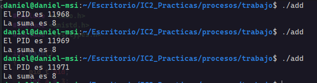{width=100%}

En cada ejecución cambia el PID que es definido por el sistema operativo.

## Procesos Padres

Los procesos padres son simplemente los procesos que crean procesos hijos. Cada proceso hijo tiene un PID único que va cambiando cada vez que se ejecuta.

En este ejemplo obtengo el proceso padre con getppid() y podemos ver como este no cambia ya que es el proceso padre del bash de la "terminal". Entonces, significa que la terminal crea un proceso hijo que es nuestro programa y se le asigna un PID, pero su proceso padre sigue siendo el mismo.

- Código

```{c, eval=FALSE}
#include <stdio.h>
#include <unistd.h>
#include <sys/types.h>

int main()
{
    pid_t pid;
    int a = 3;
    int b = 5;
    int sum = a + b;

    pid = getppid();

    printf("El PID de mi padre es: %d\n", pid);
    printf("La suma es %d\n", sum);

    return 0;
}
```

- Ejecución

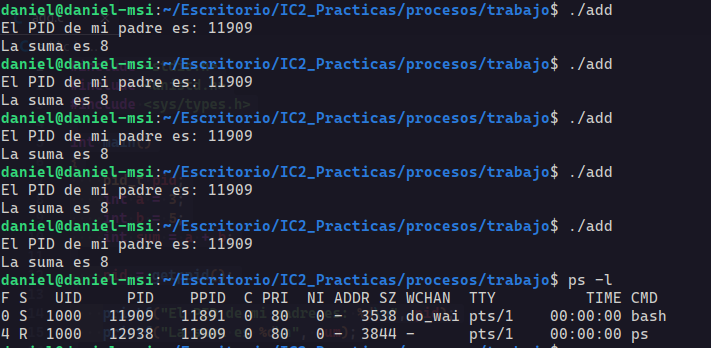{width=100%}

Como vemos, da igual cuantas veces ejecutemos el programa porque este tiene el mismo PID padre que es 11909 y que con el comando ps -l vemos que es el pid del bash de la terminal.

## Fork

La llamada al sistema fork() se usa para crear procesos hijos que son copias de los procesos padres pero con algunas exepciones, y no coge argumentos. Esto es muy necesario para la creación de nuestra propia shell, ya que tenemos ser capaces de crear procesos hijos que van a ser la ejecución de los parámetros que le pasemos.

- Valores de retorno de fork()

    - PID del proceso hijo en el proceso padre
    - 0 en el proceso hijo
    - -1 si hubo algun error
    
- Programa para probar el fork()

```{c, eval=FALSE}
#include <stdio.h>
#include <unistd.h>
#include <sys/types.h>

int main(void)
{
    pid_t pid;
    printf("Antes del fork() tengo un proceso\n");

    pid = fork();

    if(pid == -1) {
        printf("Hubo un error\n");
        return 1;
    }

    printf("Después del fork() tengo dos\n");
    return 0;
}
```


- Resultado


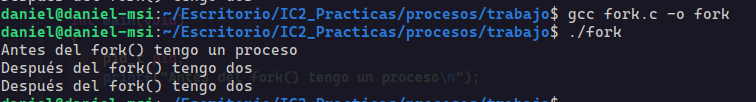{width=100%}

Cuando ejecutamos el programa, se puede ver como primero se ejecuta el mensaje antes de crear el proceso hijo. Entonces, se crea el proceso hijo y ejecuta el segundo mensaje. Cuando termina, vuelve al proceso padre y ejecuta el segundo mensaje de nuevo porque el padre no lo había ejecutado aún.

Si el proceso padre termina antes que el proceso hijo, este se queda como un proceso zombie y ya no tiene referecia al proceso padre.

```{c, eval=FALSE}
#include <stdio.h>
#include <unistd.h>
#include <sys/types.h>

int main(void)
{
    pid_t pid;
    printf("Antes del fork() tengo un proceso\n");

    pid = fork();

    if(pid == -1) {
        printf("Hubo un error\n");
        return 1;
    } else if(pid == 0) {
        sleep(1);
        printf("Proceso zombie\n");
        return 0;
    }


    printf("Después del fork() tengo dos\n");
    return 0;
}
```


## Wait

La llamada a wait() bloquea la llamada a un proceso hasta que uno de los procesos hijos termina. Después de que el proceso hijo termina, el padre continua ejecutando después de la instrucción wait().

- Código

```{c, eval=FALSE}
// C program to demonstrate working of wait()
#include<stdio.h>
#include<sys/wait.h>
#include<unistd.h>

int main()
{
    pid_t pid = fork();

    if (pid == 0)
        printf("C: Hola desde el Hijo\n");
    else
    {
        printf("P: Hola desde el padre\n");
        wait(NULL);
        printf("T: Hijo terminó\n");
    }

    printf("Adiós\n");
    return 0;
}
```


\newpage
- Ejecución


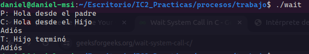{width=100%}

Aquí se puede ver como el proceso padre se ejecuta y luego espera a que termine de ejecutarse el proceso hijo y luego termina de ejecutarse el proceso padre.

## Execve

`execve()` es una llamada al sistema en sistemas operativos tipo Unix, como Linux. Se utiliza para ejecutar un programa nuevo en un proceso existente. Toma tres argumentos principales: el nombre del archivo ejecutable que se desea ejecutar, un arreglo de argumentos pasados al nuevo programa y un arreglo de variables de entorno.

Cuando execve() se invoca en un proceso, ese proceso se sobrescribe con el nuevo programa especificado en el primer argumento. Esto significa que el programa actual y su espacio de direcciones se reemplazan por el nuevo programa. El nuevo programa comienza a ejecutarse desde el principio.


- Código

```{c, eval=FALSE}
#include <stdio.h>
#include <unistd.h>
#include <sys/types.h>


int main()
{
    char *argv[] = {"/bin/ls", "-l", NULL};

    int val = execve(argv[0], argv, NULL);

    if(val == -1) {
        perror("Error");
    }
    
    printf("Se ejecutó execve");

    return 0;
}
```

\newpage

- Ejecución

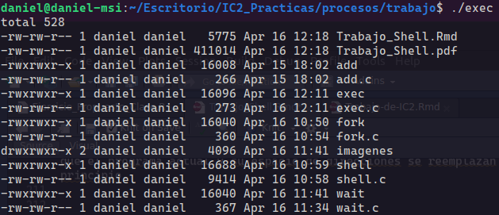{width=80%}

El programa ejecuta la instrucción que se le pasa por el vector de caracteres con los ejecutables binarios que se encuentran en el directorio /bin y ,como vemos, no se ejecuta el print("Se ejecutó execve") porque se sobrescribe la instrucción ls.

## Getline

La función `getline()` se utiliza para leer una línea de texto desde la entrada estándar y la almacena en un buffer. Esta función no hará falta para el desarollo de leer las instrucciones que se pasan por teclado. Creamos un código para que se pueda ver la ejecución de esta función:

```{c, eval=FALSE}
#include <stdio.h>
#include <stdlib.h>

int main()
{
    size_t n = 10;
    char *buf = malloc(sizeof(char) * n);

    printf("Introduce tu nombre: ");
    getline(&buf, &n, stdin);

    printf("Tu nombre es %sEl tamaño del Buffer es %ld\n", buf, n);
    free(buf);


    return(0);
}
```


- En la función main():

    - `size_t n = 10;`: Se declara una variable n de tipo size_t y se inicializa con el valor 10. Esta variable se utilizará para indicar el tamaño inicial del buffer.

    - `char *buf = malloc(sizeof(char) * n);`: Se llama a la función malloc() para asignar memoria dinámica para el buffer buf. El tamaño de la memoria asignada es sizeof(char) * n, es decir, el tamaño de un char multiplicado por n. Esto crea un buffer de caracteres con capacidad inicial para 10 caracteres.

    - `printf("Introduce tu nombre: ");`: Se imprime un mensaje solicitando al usuario que introduzca su nombre.

    - `getline(&buf, &n, stdin);`: Se llama a la función getline() para leer una línea de texto desde la entrada estándar (stdin). La línea leída se almacenará en el buffer buf. La variable n se utiliza para indicar el tamaño del buffer. Si el tamaño del nombre introducido por el usuario excede el tamaño del buffer, getline() ajustará automáticamente el tamaño del buffer para contener la línea completa.

    - `printf("Tu nombre es %sEl tamaño del Buffer es %ld\n", buf, n);`: Se imprime el nombre introducido por el usuario utilizando %s para imprimir una cadena de caracteres (char *), y se imprime el tamaño del buffer utilizando %ld para imprimir un long int.

    - `free(buf);`: Se libera la memoria asignada al buffer utilizando la función free() para evitar fugas de memoria.

- Ejecución


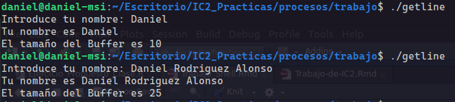{width=80%}

## Strtok


La función strtok() en C se utiliza para dividir una cadena en una serie de "tokens" o partes más pequeñas, utilizando un delimitador especificado. Es especialmente útil para analizar cadenas de texto o para dividir cadenas basadas en un cierto patrón.

La sintaxis de la función strtok() es la siguiente:

```{c, eval=FALSE}
char *strtok(char *str, const char *delim);

```


str: Es la cadena de texto que se va a dividir en tokens. En la primera llamada a strtok(), este argumento debe ser la cadena original. En llamadas subsiguientes, se debe pasar NULL para indicar que se debe continuar dividiendo la misma cadena.

delim: Es una cadena que contiene los caracteres delimitadores. strtok() utiliza estos caracteres para determinar dónde se deben realizar las divisiones en la cadena.

La función strtok() devuelve un puntero al siguiente token encontrado en la cadena str, o NULL si no se encontró ningún token más. Además, modifica la cadena original str, reemplazando el delimitador con el carácter nulo '\0' para indicar el final del token encontrado.

- Código

```{c, eval=FALSE}
#include <stdio.h>
#include <string.h>

int main() {
    char str[] = "Hola,mundo,estoy,usando,strtok";
    const char delim[] = ",";

    char *token = strtok(str, delim);

    while (token != NULL) {
        printf("Token: %s\n", token);
        token = strtok(NULL, delim);
    }

    return 0;
}
```


- Ejecución

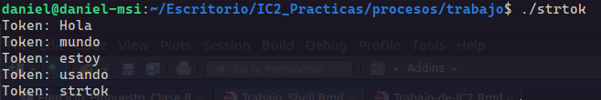{width=80%}

\newpage

# Desarrollo de la Shell

Una vez tenido en cuenta los conocimientos de las funciones que hemos repasado en este PDF, podemos ponernos a actualizar el diagrama de flujo y empezar a desarrollar nuestra propia shell.

## Diagrama de Flujo Actualizado

.png){width=67%}


\newpage

## While y obteniendo lineas de teclado

```{c, eval=FALSE}
#include <stdio.h>
#include <stdlib.h>
#include <string.h>

int SonIguales(const char *str1, const char *str2) {
	return strcmp(str1, str2) == 0;
}

int main()
{
	// Tamaño inicial del buffer
	size_t n = 10;
	char *buf = malloc(sizeof(char) * n);
	// Creamos una variable para controlar la salida del bucle
	int seguir_ejecutandose = 1;

	//Bucle principal del programa
	while(seguir_ejecutandose) {
		printf("Introduzca un comando: ");
		getline(&buf, &n, stdin);

		// Salir del bucle si se introduce exit o exit()
		if(SonIguales(buf, "exit") || SonIguales(buf, "exit()")) {
			// Ponemos el valor de seguir_ejecutandose a 0
			seguir_ejecutandose = 0;
			continue;
		}
	}
	free(buf);
	return 0;
}
```

- Ejecución 

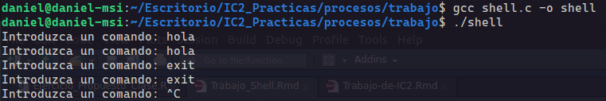{width=80%}

Vemos que el programa no nos dio ningún problema al ser compilado, pero no esta funcionando como queremos. Tenemos el problema de que cuando introducimos algo por teclado, la línea que introducimos incluye el salto de linea `\n` y, cuando lo comparo con la string "exit" o "exit()", devuleve que no son iguales.

- Solución

    Tengo que quitar el salto de línea por un caracter \0 para poder compararlo y que realmente funcione la función de SonIguales().


```{c, eval=FALSE}
#include <stdio.h>
#include <stdlib.h>
#include <string.h>

int SonIguales(const char *str1, const char *str2) {
	return strcmp(str1, str2) == 0;
}

int main()
{
	// Tamaño inicial del buffer
	size_t n = 10;
	char *buf = malloc(sizeof(char) * n);
	// Creamos una variable para controlar la salida del bucle
	int seguir_ejecutandose = 1;

	//Bucle principal del programa
	while(seguir_ejecutandose) {
		printf("Introduzca un comando: ");
		getline(&buf, &n, stdin);

		// Cambiando el \n por un \0
		if((strlen(buf) > 0) && (buf[strlen(buf) - 1] == '\n')) {
			buf[strlen(buf) - 1] = '\0';
		}

		// Salir del bucle si se introduce exit o exit()
		if(SonIguales(buf, "exit") || SonIguales(buf, "exit()")) {
			// Ponemos el valor de seguir_ejecutandose a 0
			seguir_ejecutandose = 0;
			continue;
		}
	}
	free(buf);
	return 0;
}
```

- Ejecución 

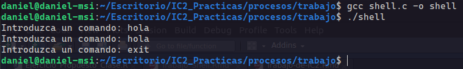{width=80%}

## Creando proceso hijo y dividiendo entrada

Una vez que somos capaces de obtener de teclado varias intrucciones que introduzca el ususario y saber cuando quiere terminar de ejecutar el shell, podemos empezar a crear un proceso hijo que va a ser el que ejecute las instrucciones. Adsemás, tendremos que dividir la entrada del teclado por espacios.

- Código

```{c, eval=FALSE}
#include <stdio.h> // Para poder imprimir por pantalla
#include <stdlib.h> // Para poder usar getline()
#include <string.h> // Para poder usar strcmp() 
#include <sys/types.h> // para poder usar pid_t
#include <unistd.h> // Necesario para declarar el fork()
#include <sys/wait.h> // Para poder usar el wait()

#define MAX_ARGUMENTS 40

int SonIguales(const char *str1, const char *str2) {
	return strcmp(str1, str2) == 0;
}

int main()
{
	// Tamaño inicial del buffer
	size_t n = 10;
	char *buf = malloc(sizeof(char) * n);
	// Creamos una variable para controlar la salida del bucle
	int seguir_ejecutandose = 1;
	// Arreglo de argumentos
	char *args[MAX_ARGUMENTS];

	//Bucle principal del programa
	while(seguir_ejecutandose) {
		printf("Introduzca un comando: ");
		getline(&buf, &n, stdin);

		// Cambiando el \n por un \0
		if((strlen(buf) > 0) && (buf[strlen(buf) - 1] == '\n')) {
			buf[strlen(buf) - 1] = '\0';
		}

		// Salir del bucle si se introduce exit o exit()
		if(SonIguales(buf, "exit") || SonIguales(buf, "exit()")) {
			// Ponemos el valor de seguir_ejecutandose a 0
			seguir_ejecutandose = 0;
			continue;
		}

		// Creamos un proceso hijo
		pid_t pid;

		pid = fork();

		if (pid == -1) {
			// Error al crear el hijo
			perror("Error al crearse el proceso hijo");
			exit(1);
		} else if (pid == 0) {
			// Proceso hijo
			printf("PID del proceso hijo %d\n", getpid());
			printf("PID del proceso padre es %d\n", getppid());

			// Dividimos la entrada del usuario por tokens
			char *token = strtok(buf, " ");
			int i = 0;
			while(token != NULL) {
				args[i++] = token;
				token = strtok(NULL, " ");
			}
			args[i] = NULL;

			i = 0;
			// Imprimimos lo que contiene args para ver si funciona
			while(args[i] != NULL) {
				printf("%s\n", args[i]);
				i++;
			}
			exit(0); //Salir del proceso hijo después de procesar el comando
		} else {
			// Proceso padre
			wait(NULL);
		}
	}
	free(buf);
	return 0;
}
```

- Ejecución


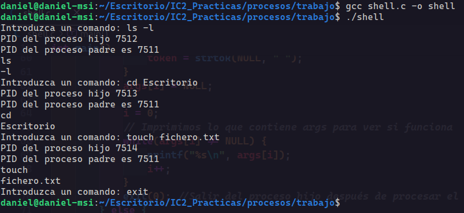{width=100%}

Vemos como el programa funciona como esperamos ya que nos deja introducir los comandos por pantalla y cuando damos "enter" nos imprime correctamente el PID del padre y el PID del hijo con la instruccion separada.

## Ejecutando los comandos

Ahora, vamos a utilizar la función execve que hemos visto en este PDF para poder ejecutar los comandos que sean introducidos por terminal.

- Código

```{c, eval=FALSE}
#include <stdio.h> // Para poder imprimir por pantalla
#include <stdlib.h> // Para poder usar getline()
#include <string.h> // Para poder usar strcmp() 
#include <sys/types.h> // para poder usar pid_t
#include <unistd.h> // Necesario para declarar el fork()
#include <sys/wait.h> // Para poder usar el wait()

#define MAX_ARGUMENTS 40

int SonIguales(const char *str1, const char *str2) {
	return strcmp(str1, str2) == 0;
}

int main()
{
	// Tamaño inicial del buffer
	size_t n = 10;
	char *buf = malloc(sizeof(char) * n);
	// Creamos una variable para controlar la salida del bucle
	int seguir_ejecutandose = 1;
	// Arreglo de argumentos
	char *args[MAX_ARGUMENTS];

	//Bucle principal del programa
	while(seguir_ejecutandose) {
		printf("Introduzca un comando: ");
		getline(&buf, &n, stdin);

		// Cambiando el \n por un \0
		if((strlen(buf) > 0) && (buf[strlen(buf) - 1] == '\n')) {
			buf[strlen(buf) - 1] = '\0';
		}

		// Salir del bucle si se introduce exit o exit()
		if(SonIguales(buf, "exit") || SonIguales(buf, "exit()")) {
			// Ponemos el valor de seguir_ejecutandose a 0
			seguir_ejecutandose = 0;
			continue;
		}

		// Creamos un proceso hijo
		pid_t pid;

		pid = fork();

		if (pid == -1) {
			// Error al crear el hijo
			perror("Error al crearse el proceso hijo");
			exit(1);
		} else if (pid == 0) {
			// Proceso hijo
			printf("PID del proceso hijo %d\n", getpid());
			printf("PID del proceso padre es %d\n", getppid());

			// Dividimos la entrada del usuario por tokens
			char *token = strtok(buf, " ");
			int i = 0;
			while(token != NULL) {
				args[i++] = token;
				token = strtok(NULL, " ");
			}
			args[i] = NULL;

			execve(args[0], args, NULL);
			exit(1); //Salir si execve falla
		} else {
			// Proceso padre
			wait(NULL);
		}
	}
	free(buf);
	return 0;
}
```

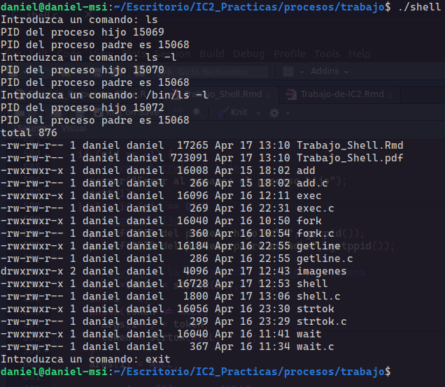{width=70%}

Como vemos en la ejecución, cuando ponemos ls no se ejecuta nada por que es necesario poner `/bin/` delante del comando que quermos ejecutar para que pueda ejecutar los ejecutables que tenemos en `/bin/`.

```{c, eval=FALSE}
#include <stdio.h> // Para poder imprimir por pantalla
#include <stdlib.h> // Para poder usar getline()
#include <string.h> // Para poder usar strcmp() 
#include <sys/types.h> // para poder usar pid_t
#include <unistd.h> // Necesario para declarar el fork()
#include <sys/wait.h> // Para poder usar el wait()

#define MAX_ARGUMENTS 40

int SonIguales(const char *str1, const char *str2) {
	return strcmp(str1, str2) == 0;
}

int main()
{
	// Tamaño inicial del buffer
	size_t n = 10;
	char *buf = malloc(sizeof(char) * n);
	// Creamos una variable para controlar la salida del bucle
	int seguir_ejecutandose = 1;
	// Arreglo de argumentos
	char *args[MAX_ARGUMENTS];

	//Bucle principal del programa
	while(seguir_ejecutandose) {
		printf("Introduzca un comando: ");
		getline(&buf, &n, stdin);

		// Cambiando el \n por un \0
		if((strlen(buf) > 0) && (buf[strlen(buf) - 1] == '\n')) {
			buf[strlen(buf) - 1] = '\0';
		}

		// Salir del bucle si se introduce exit o exit()
		if(SonIguales(buf, "exit") || SonIguales(buf, "exit()")) {
			// Ponemos el valor de seguir_ejecutandose a 0
			seguir_ejecutandose = 0;
			continue;
		}

		// Creamos un proceso hijo
		pid_t pid;

		pid = fork();

		if (pid == -1) {
			// Error al crear el hijo
			perror("Error al crearse el proceso hijo");
			exit(1);
		} else if (pid == 0) {
			// Proceso hijo
			printf("PID del proceso hijo %d\n", getpid());
			printf("PID del proceso padre es %d\n", getppid());

			// Dividimos la entrada del usuario por tokens
			char *token = strtok(buf, " ");
			int i = 0;
			while(token != NULL) {
				args[i++] = token;
				token = strtok(NULL, " ");
			}
			args[i] = NULL;

			// Concatenar '/bin/' con el primer argumento
			char *temp = malloc(strlen("/bin/") + strlen(args[0]) + 1);
			strcpy(temp, "/bin/");
			strcat(temp, args[0]);
			args[0] = temp;

			execve(args[0], args, NULL);
			exit(1); //Salir si execve falla
		} else {
			// Proceso padre
			wait(NULL);
		}
	}
	free(buf);
	return 0;
}
```


### Ejecución

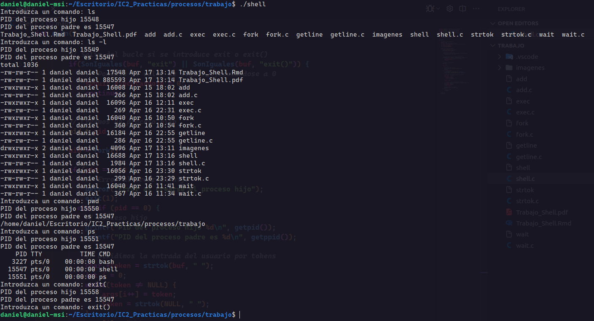{width=90%}

Una vez visto que funciona el programa, podemos decir que tenemos la primera versión de nuestro programa realizado, la cual sería la version 0.0.1:

## Versión 0.0.1

```{c, eval=FALSE}
#include <stdio.h> // Para poder imprimir por pantalla
#include <stdlib.h> // Para poder usar getline()
#include <string.h> // Para poder usar strcmp() 
#include <sys/types.h> // para poder usar pid_t
#include <unistd.h> // Necesario para declarar el fork()
#include <sys/wait.h> // Para poder usar el wait()

#define MAX_ARGUMENTS 40

int SonIguales(const char *str1, const char *str2) {
	return strcmp(str1, str2) == 0;
}

int main()
{
	// Tamaño inicial del buffer
	size_t n = 10;
	char *buf = malloc(sizeof(char) * n);
	// Creamos una variable para controlar la salida del bucle
	int seguir_ejecutandose = 1;
	// Arreglo de argumentos
	char *args[MAX_ARGUMENTS];

	//Bucle principal del programa
	while(seguir_ejecutandose) {
		printf("Introduzca un comando: ");
		getline(&buf, &n, stdin);

		// Cambiando el \n por un \0
		if((strlen(buf) > 0) && (buf[strlen(buf) - 1] == '\n')) {
			buf[strlen(buf) - 1] = '\0';
		}

		// Salir del bucle si se introduce exit o exit()
		if(SonIguales(buf, "exit") || SonIguales(buf, "exit()")) {
			// Ponemos el valor de seguir_ejecutandose a 0
			seguir_ejecutandose = 0;
			continue;
		}

		// Creamos un proceso hijo
		pid_t pid;

		pid = fork();

		if (pid == -1) {
			// Error al crear el hijo
			perror("Error al crearse el proceso hijo");
			exit(1);
		} else if (pid == 0) {
			// Proceso hijo
			printf("PID del proceso hijo %d\n", getpid());
			printf("PID del proceso padre es %d\n", getppid());

			// Dividimos la entrada del usuario por tokens
			char *token = strtok(buf, " ");
			int i = 0;
			while(token != NULL) {
				args[i++] = token;
				token = strtok(NULL, " ");
			}
			args[i] = NULL;

			// Concatenar '/bin/' con el primer argumento
			char *temp = malloc(strlen("/bin/") + strlen(args[0]) + 1);
			strcpy(temp, "/bin/");
			strcat(temp, args[0]);
			args[0] = temp;

			execve(args[0], args, NULL);
			exit(1); //Salir si execve falla
		} else {
			// Proceso padre
			wait(NULL);
		}
	}
	free(buf);
	return 0;
}
```

## Añadiendo experiencia de usuario

En esta parte, vamos a actualizar el código para poder mejorar la experiencia de usuario. Tenemos que controlar; si al ejecutar el código este falla, en el cursor aparecerá estos caracteres ":(", si se ejecuta correctamente, entonces aparecería ":)". Este sería el codigo que le añadimos a la versión 0.0.1:

- Código

```{c, eval=FALSE}
char *cara = ":)";
// Creamos el estado que devolvera el hijo 
int status;
int resultado = execve(args[0], args, NULL);

			// Si no se puede ejecutar el comando
			if (resultado == -1) {
				perror("El comando no se puede ejecutar");
				exit(1); //Salir si execve falla
			}
		} else {
			// Proceso padre
			wait(&status); // Espera a que termine el hijo
			if(WEXITSTATUS(status) == 1) {
				cara = ":(";
			} else {
				cara = ":)";
			}
```

En este caso controlamos la salida que produce el hijo en caso de que este devuleva el codigo 1 entonces cambiara la variable de cara a ":(" si no se devuelve el error 1 la cara tendrá los caracteres ":)"

- Ejecución


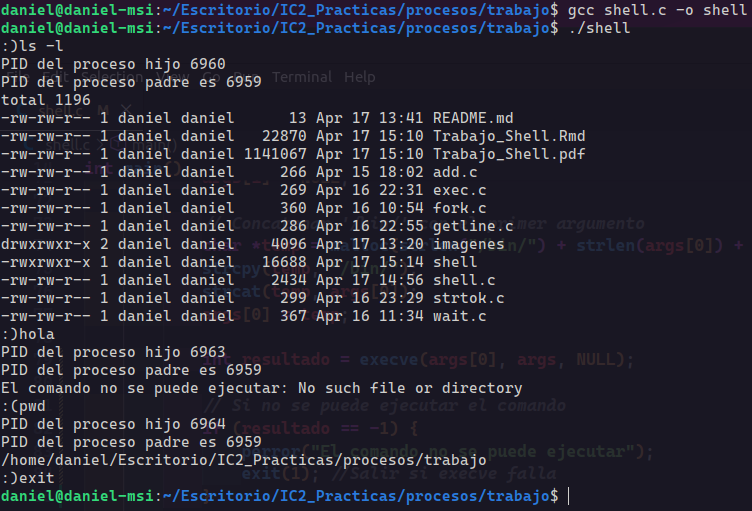{width=100%}


## Versión 0.0.2

Nos damos cuenta de que el problema anterior se puede solucionar fácil cambiando execve() por execvp(). De esta manera se nos queda un código más compacto y sencillo:

```{c, eval=FALSE}
#include <stdio.h> // Para poder imprimir por pantalla
#include <stdlib.h> // Para poder usar getline()
#include <string.h> // Para poder usar strcmp() 
#include <sys/types.h> // para poder usar pid_t
#include <unistd.h> // Necesario para declarar el fork()
#include <sys/wait.h> // Para poder usar el wait()

#define MAX_ARGUMENTS 40

int SonIguales(const char *str1, const char *str2) {
	return strcmp(str1, str2) == 0;
}

int main()
{
	// Tamaño inicial del buffer
	size_t n = 10;
	char *buf = malloc(sizeof(char) * n);
	// Creamos una variable para controlar la salida del bucle
	int seguir_ejecutandose = 1;
	// Arreglo de argumentos
	char *args[MAX_ARGUMENTS];
	char *cara = ":)";
	// Creamos el estado que devolvera el hijo 
	int status;

	//Bucle principal del programa
	while(seguir_ejecutandose) {
		printf("%s", cara);
		getline(&buf, &n, stdin);

		// Cambiando el \n por un \0
		if((strlen(buf) > 0) && (buf[strlen(buf) - 1] == '\n')) {
			buf[strlen(buf) - 1] = '\0';
		}

		// Salir del bucle si se introduce exit o exit()
		if(SonIguales(buf, "exit") || SonIguales(buf, "exit()")) {
			// Ponemos el valor de seguir_ejecutandose a 0
			seguir_ejecutandose = 0;
			continue;
		}

		// Comprobar que se introduce clear por terminal
		if(SonIguales(buf, "clear")) {
			printf("\033[2J\033[H");
			continue;
		}

		// Creamos un proceso hijo
		pid_t pid;

		pid = fork();

		if (pid == -1) {
			// Error al crear el hijo
			perror("Error al crearse el proceso hijo");
			exit(1);
		} else if (pid == 0) {
			// Proceso hijo
			printf("PID del proceso hijo %d\n", getpid());
			printf("PID del proceso padre es %d\n", getppid());

			// Dividimos la entrada del usuario por tokens
			char *token = strtok(buf, " ");
			int i = 0;
			while(token != NULL) {
				args[i++] = token;
				token = strtok(NULL, " ");
			}
			args[i] = NULL;
			execvp(args[0], args);
			exit(1); //Salir si execve falla
		} else {
			// Proceso padre
			wait(&status); // Espera a que termine el hijo
			if(WEXITSTATUS(status) == 1) {
				cara = ":(";
			} else {
				cara = ":)";
			}
		}
	}
	free(buf);
	return 0;
}

```

- Ejecución 

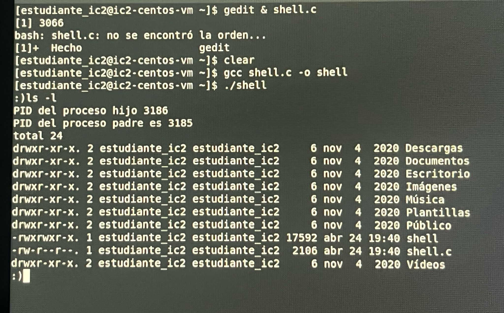{width=70%}


# Requisitos opcionales

## Cálculo del tiempo que tarda en ejecutarse el hijo y versión 0.0.3

Este apartado lo elaboraremos de tres maneras distintas

- La función times:

```{c, eval=FALSE}
#include <stdio.h> // Para poder imprimir por pantalla
#include <stdlib.h> // Para poder usar getline()
#include <string.h> // Para poder usar strcmp() 
#include <sys/types.h> // para poder usar pid_t
#include <unistd.h> // Necesario para declarar el fork()
#include <sys/wait.h> // Para poder usar el wait()
#include <time.h> //Para time y difftime


#define MAX_ARGUMENTS 40

int SonIguales(const char *str1, const char *str2) {
	return strcmp(str1, str2) == 0;
}

int main()
{
	// Tamaño inicial del buffer
	size_t n = 10;
	char *buf = malloc(sizeof(char) * n);
	// Creamos una variable para controlar la salida del bucle
	int seguir_ejecutandose = 1;
	// Arreglo de argumentos
	char *args[MAX_ARGUMENTS];
	char *cara = ":)";
	// Creamos el estado que devolvera el hijo 
	int status;
	// Variables para medir el tiempo en segundos del proceso hijo
    time_t start, end;

	//Bucle principal del programa
	while(seguir_ejecutandose) {
		printf("%s", cara);
		getline(&buf, &n, stdin); //Para guardar la línea de entrada en el buffer

		// Cambiando el \n por un \0
		if((strlen(buf) > 0) && (buf[strlen(buf) - 1] == '\n')) {
			buf[strlen(buf) - 1] = '\0';
		}

		// Salir del bucle si se introduce exit o exit()
		 //compara las cadenas de caracteres "buf" con "exit" o "exit()"
		if(SonIguales(buf, "exit") || SonIguales(buf, "exit()")) {
			// Ponemos el valor de seguir_ejecutandose a 0
			seguir_ejecutandose = 0;
			continue;
		}

		// Compara las cadenas de caracteres "buf" con "exit" o "exit()"
		if(SonIguales(buf, "clear")) { 
			printf("\033[2J\033[H"); //para limpiar la pantalla de la terminal
			continue;
		}

		// Creamos un proceso hijo
		pid_t pid;

		start = time(NULL); // Medir tiempo de inicio del proceso hijo
		pid = fork();
		// Creamos el sleep para ver si funciona el tiempo de ejecución del proceso hijo
		//sleep(5);
		if (pid == -1) {
			// Error al crear el hijo
			perror("Error al crearse el proceso hijo");
			exit(1);
		} else if (pid == 0) {
			// Proceso hijo
			printf("PID del proceso hijo %d\n", getpid());
			printf("PID del proceso padre es %d\n", getppid());

			// Dividimos la entrada del usuario por tokens
			char *token = strtok(buf, " ");
			int i = 0;
			while(token != NULL) {
				args[i++] = token;
				token = strtok(NULL, " ");
			}
			args[i] = NULL;
			
			execvp(args[0], args);
			exit(1); //Salir si execve falla
		} else {
			// Proceso padre
			wait(&status); // Espera a que termine el hijo
			end = time(NULL); // Medir tiempo de fin del proceso hijo
			if(WEXITSTATUS(status) == 1) {
				cara = ":(";
			} else {
				cara = ":)";
			}
			// Calcular y mostrar el tiempo de ejecución del proceso hijo
            double tiempo = difftime(end, start);
            printf("El proceso hijo tardó %f segundos en ejecutarse.\n", tiempo);
		}
	}
	free(buf);
	return 0;
}

```

Se obtiene el tiempo justo antes de crear el proceso hijo (start), se obtiene otro tiempo justo después de que el hijo termina (end), y la diferencia entre estos tiempos (difftime(end, start)) da el tiempo de ejecución del proceso hijo

- Ejecución

.jpeg){width=100%}

- La función getrusage:

```{c, eval=FALSE}
#include <stdio.h> // Para poder imprimir por pantalla
#include <stdlib.h> // Para poder usar getline()
#include <string.h> // Para poder usar strcmp() 
#include <sys/types.h> // para poder usar pid_t
#include <unistd.h> // Necesario para declarar el fork()
#include <sys/wait.h> // Para poder usar el wait()
#include <sys/time.h> // Para poder usar getrusage()
#include <sys/resource.h> // Para poder usar RUSAGE_SELF y RUSAGE_CHILDREN

#define MAX_ARGUMENTS 40

int SonIguales(const char *str1, const char *str2) {
	return strcmp(str1, str2) == 0;
}

int main()
{
	// Tamaño inicial del buffer
	size_t n = 10;
	char *buf = malloc(sizeof(char) * n);
	// Creamos una variable para controlar la salida del bucle
	int seguir_ejecutandose = 1;
	// Arreglo de argumentos
	char *args[MAX_ARGUMENTS];
	char *cara = ":)";
	// Creamos el estado que devolvera el hijo 
	int status;

	//Bucle principal del programa
	while(seguir_ejecutandose) {
		printf("%s", cara);
		getline(&buf, &n, stdin);

		// Cambiando el \n por un \0
		if((strlen(buf) > 0) && (buf[strlen(buf) - 1] == '\n')) {
			buf[strlen(buf) - 1] = '\0';
		}

		// Salir del bucle si se introduce exit o exit()
		if(SonIguales(buf, "exit") || SonIguales(buf, "exit()")) {
			// Ponemos el valor de seguir_ejecutandose a 0
			seguir_ejecutandose = 0;
			continue;
		}

		// Comprobar que se introduce clear por terminal
		if(SonIguales(buf, "clear")) {
			printf("\033[2J\033[H");
			continue;
		}

		// Creamos un proceso hijo
		pid_t pid;

		struct rusage usage;

		pid = fork();

		if (pid == -1) {
			// Error al crear el hijo
			perror("Error al crearse el proceso hijo");
			exit(1);
		} else if (pid == 0) {
			// Proceso hijo
			printf("PID del proceso hijo %d\n", getpid());
			printf("PID del proceso padre es %d\n", getppid());

			// Dividimos la entrada del usuario por tokens
			char *token = strtok(buf, " ");
			int i = 0;
			while(token != NULL) {
				args[i++] = token;
				token = strtok(NULL, " ");
			}
			args[i] = NULL;
			getrusage(RUSAGE_SELF, &usage);
			execvp(args[0], args);
			exit(1); //Salir si execve falla
		} else {
			// Proceso padre
			wait(&status); // Espera a que termine el hijo
			getrusage(RUSAGE_CHILDREN, &usage);
			// Calcula el tiempo de ejecución del proceso hijo
			double time_used = usage.ru_utime.tv_sec + usage.ru_utime.tv_usec / 1000000.0;
			printf("Tiempo de ejecución del proceso hijo: %f segundos\n", time_used);
			if(WEXITSTATUS(status) == 1) {
				cara = ":(";
			} else {
				cara = ":)";
			}
		}
	}
	free(buf);
	return 0;
}
```

En esta función, el struct rusage se usa para obtener información detallada sobre el uso de recursos por parte del proceso hijo. En este caso específico, se utiliza para obtener el tiempo de CPU que el proceso hijo ha utilizado en modo de usuario (ru_utime), lo cual nos da una idea del tiempo que ha tardado en ejecutarse el comando específico ingresado por el usuario.

- Ejecución

.jpeg){width=90%}

- Función timespec_get

```{c, eval=FALSE}
#include <time.h> // Para usar timespec_get
#include <stdio.h> // Para poder imprimir por pantalla
#include <stdlib.h> // Para poder usar getline()
#include <string.h> // Para poder usar strcmp() 
#include <sys/types.h> // para poder usar pid_t
#include <unistd.h> // Necesario para declarar el fork()
#include <sys/wait.h> // Para poder usar el wait()

#define MAX_ARGUMENTS 40

int SonIguales(const char *str1, const char *str2) {
	return strcmp(str1, str2) == 0;
}

int main()
{

	// Tamaño inicial del buffer
	size_t n = 10;
	char *buf = malloc(sizeof(char) * n);
	// Creamos una variable para controlar la salida del bucle
	int seguir_ejecutandose = 1;
	// Arreglo de argumentos
	char *args[MAX_ARGUMENTS];
	char *cara = ":)";
	// Creamos el estado que devolvera el hijo 
	int status;

	//Bucle principal del programa
	while(seguir_ejecutandose) {
		printf("%s", cara);
		getline(&buf, &n, stdin);

		// Cambiando el \n por un \0
		if((strlen(buf) > 0) && (buf[strlen(buf) - 1] == '\n')) {
			buf[strlen(buf) - 1] = '\0';
		}

		// Salir del bucle si se introduce exit o exit()
		if(SonIguales(buf, "exit") || SonIguales(buf, "exit()")) {
			// Ponemos el valor de seguir_ejecutandose a 0
			seguir_ejecutandose = 0;
			continue;
		}

		// Comprobar que se introduce clear por terminal
		if(SonIguales(buf, "clear")) {
			printf("\033[2J\033[H");
			continue;
		}

		// Creamos un proceso hijo
		pid_t pid;
		
		// Obtenemos la marca de tiempo de inicio
		struct timespec begin;
		timespec_get(&begin, TIME_UTC);

		pid = fork();

		if (pid == -1) {
			// Error al crear el hijo
			perror("Error al crearse el proceso hijo");
			exit(1);
		} else if (pid == 0) {
			// Proceso hijo
			printf("PID del proceso hijo %d\n", getpid());
			printf("PID del proceso padre es %d\n", getppid());

			// Dividimos la entrada del usuario por tokens
			char *token = strtok(buf, " ");
			int i = 0;
			while(token != NULL) {
				args[i++] = token;
				token = strtok(NULL, " ");
			}
			args[i] = NULL;
			execvp(args[0], args);
			exit(1); //Salir si execve falla
		} else {
			// Proceso padre
			wait(&status); // Espera a que termine el hijo
			// Obtenemos la marca de tiempo final
			struct timespec end;
			timespec_get(&end, TIME_UTC);

			// Calcula el tiempo de ejecución del proceso hijo
			double time_spent = (end.tv_sec - begin.tv_sec) + 
			  (end.tv_nsec - begin.tv_nsec) / 1000000000.0;
			printf("Tiempo de ejecución del proceso hijo: %f segundos\n", time_spent);
			if(WEXITSTATUS(status) == 1) {
				cara = ":(";
			} else {
				cara = ":)";
			}
		}
	}
	free(buf);
	return 0;
}
```

Para utilizar la función `timespec_get()`, solo necesitamos registrar el tiempo de inicio y el tiempo de finalización del cálculo. Esto se logra restando el tiempo final del tiempo inicial. Esta operación nos proporcionará el tiempo transcurrido desde que el proceso hijo comenzó a ejecutarse. Luego, este tiempo se muestra en la pantalla. Este será  nuestra versión 0.0.3 del código.

## Cambio del directorio con cd

Para abordar este apartado, consideraremos dos aspectos importantes. En primer lugar, debemos manejar la situación en la que el directorio al que deseamos desplazarnos no existe. En segundo lugar, debemos contemplar el escenario en el que queremos trasladarnos al directorio principal del usuario que está utilizando la terminal, lo cual se logra mediante el comando cd en Linux sin ningún parámetro. Después de implementar el comando cd, alcanzamos la versión 0.0.4.

## Versión 0.0.4

- Código

```{c, eval=FALSE}
#include <time.h> // Para usar timespec_get
#include <stdio.h> // Para poder imprimir por pantalla
#include <stdlib.h> // Para poder usar getline()
#include <string.h> // Para poder usar strcmp() 
#include <sys/types.h> // para poder usar pid_t
#include <unistd.h> // Necesario para declarar el fork()
#include <sys/wait.h> // Para poder usar el wait()
#include <pwd.h> // para usar el struct passwd
#include <errno.h> // para usar una variable errno

#define MAX_ARGUMENTS 40

int SonIguales(const char *str1, const char *str2) {
	return strcmp(str1, str2) == 0;
}

int main()
{
	// Tamaño inicial del buffer
	size_t n = 10;
	char *buf = malloc(sizeof(char) * n);
	// Creamos una variable para controlar la salida del bucle
	int seguir_ejecutandose = 1;
	// Arreglo de argumentos
	char *args[MAX_ARGUMENTS];
	char *cara = ":)";
	// Creamos el estado que devolvera el hijo 
	int status;

	//Bucle principal del programa
	while(seguir_ejecutandose) {
		printf("%s", cara);
		getline(&buf, &n, stdin);

		// Cambiando el \n por un \0
		if((strlen(buf) > 0) && (buf[strlen(buf) - 1] == '\n')) {
			buf[strlen(buf) - 1] = '\0';
		}

		// Salir del bucle si se introduce exit o exit()
		if(SonIguales(buf, "exit") || SonIguales(buf, "exit()")) {
			// Ponemos el valor de seguir_ejecutandose a 0
			seguir_ejecutandose = 0;
			continue;
		}

		// Comprobar que se introduce clear por terminal
		if(SonIguales(buf, "clear")) {
			printf("\033[2J\033[H");
			continue;
		}

		// Dividimos la entrada del usuario por tokens
		char *token = strtok(buf, " ");
		int i = 0;
		while(token != NULL) {
			args[i++] = token;
			token = strtok(NULL, " ");
		}
		args[i] = NULL;

		// Implementamos el comando cd
		if(SonIguales(args[0], "cd")){
			struct passwd *pwd;
			char* path = args[1];
			if(path == NULL) {
				pwd = getpwuid(getuid());
				path = pwd->pw_dir;
			}
			errno = chdir(path);
			if (errno != 0){
				printf("No existe ese directorio o hubo un error\n");
				cara = ":(";
			} else {
				printf("Se cambió al directorio %s\n", path);
				cara = ":)";
			}
			continue;
		}

		// Creamos un proceso hijo
		pid_t pid;
		
		// Obtenemos la marca de tiempo de inicio
		struct timespec begin;
		timespec_get(&begin, TIME_UTC);

		pid = fork();

		if (pid == -1) {
			// Error al crear el hijo
			perror("Error al crearse el proceso hijo");
			exit(1);
		} else if (pid == 0) {
			// Proceso hijo
			printf("PID del proceso hijo %d\n", getpid());
			printf("PID del proceso padre es %d\n", getppid());

			execvp(args[0], args);
			exit(1); //Salir si execve falla
		} else {
			// Proceso padre
			wait(&status); // Espera a que termine el hijo
			// Obtenemos la marca de tiempo final
			struct timespec end;
			timespec_get(&end, TIME_UTC);

			// Calcula el tiempo de ejecución del proceso hijo
			double time_spent = (end.tv_sec - begin.tv_sec) + 
			  (end.tv_nsec - begin.tv_nsec) / 1000000000.0;
			printf("Tiempo de ejecución del proceso hijo: %f segundos\n", time_spent);
			if(WEXITSTATUS(status) == 1) {
				cara = ":(";
			} else {
				cara = ":)";
			}
		}
	}
	free(buf);
	return 0;
}
```


El fragmento de código proporcionado implementa la funcionalidad del comando `cd` dentro de un programa de línea de comandos en C. 

Cuando el usuario ingresa el comando cd seguido de un directorio, el programa intenta cambiar al directorio especificado utilizando la función `chdir()`. Si el usuario no proporciona ningún directorio, el programa cambia al directorio personal del usuario. Si la operación de cambio de directorio tiene éxito, se imprime un mensaje indicando el cambio, y se establece una variable de estado (cara) en ":)" para indicar un resultado positivo. 

Por otro lado, si la operación falla (por ejemplo, debido a un directorio inexistente), se imprime un mensaje de error y se establece cara en ":(" para indicar un resultado negativo. Después de manejar el comando `cd`, el programa continúa esperando nuevos comandos de entrada del usuario en un bucle principal.

\newpage

## Ejecución final

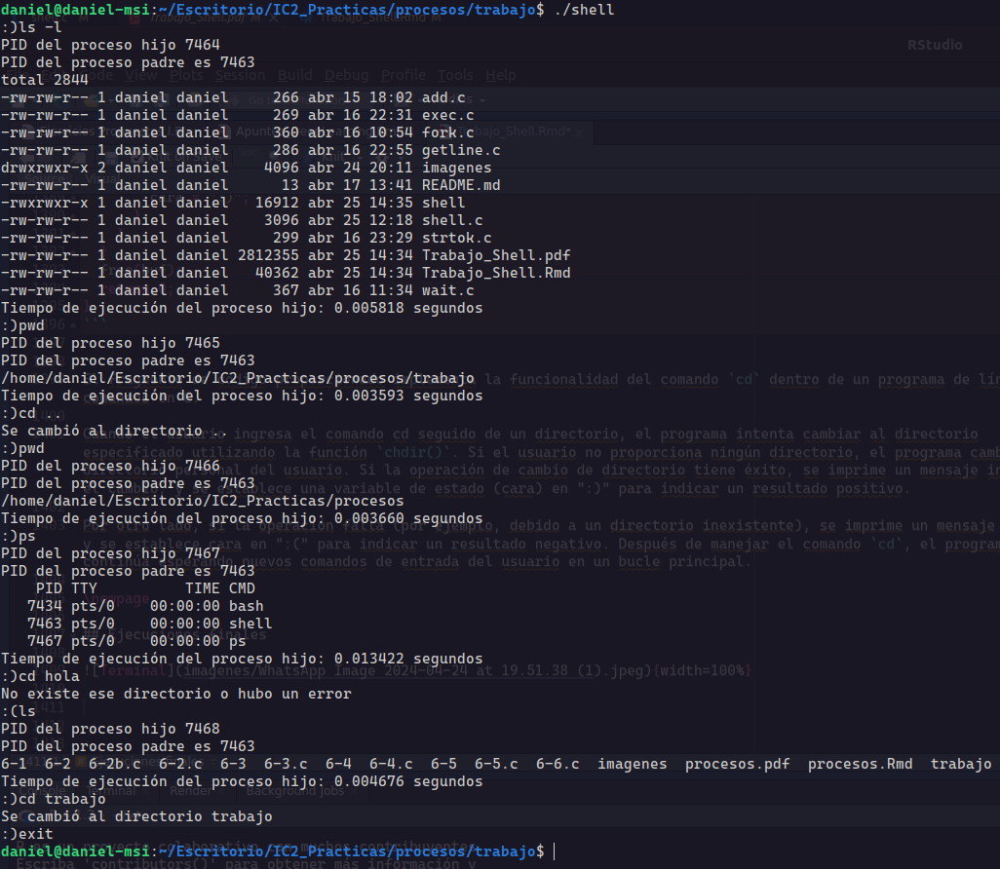{width=100%}

# Conclusión

El desarrollo de esta terminal básica en C ha sido un proceso gratificante para nuestro equipo, proporcionándonos un profundo conocimiento sobre el manejo de procesos y las funciones esenciales para una shell funcional. A través de la colaboración y la investigación, logramos crear una terminal básica. Para la próxima entrega, nos enfocaremos en integrar la ejecución asíncrona con "&", permitiendo que los procesos se ejecuten en segundo plano. Esto nos proporcionará una valiosa experiencia en el desarrollo de software en entornos de sistemas operativos.

El repositorio del proyecto es el siguiente [GitHub]

[GitHub]: https://github.com/danirodriguezz/Shell-en-C

