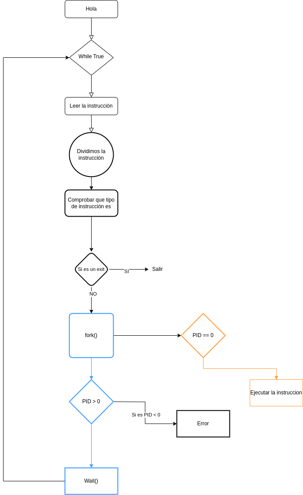

```{r setup, include=FALSE}
knitr::opts_chunk$set(echo = TRUE)
```

\newpage

# Flujo de Ejecución

Para el desarrollo de este shell tenemos que tener en cuenta el flujo de ejecución de nuestro programa, que será el siguiente

{width=50%}

# Conceptos para crear un Shell

## Process ID (PID)

El PID es una abreviatura del process ID, osea del ID del proceso o **identificador del procesos**. El identificador de procesos es un numero entero usado por el Kernel de algunos sistemas operativos(Como el de **Unix** o el de **Windows NT**) para identificar un proceso de forma unívoca.

Mostramos un codigo ejemplo para que se vea como se obtiene el PID en C.

```{c, eval=FALSE}
#include <stdio.h>
#include <unistd.h>
#include <sys/types.h>

int main()
{
    pid_t pid;
    int a = 3;
    int b = 5;
    int sum = a + b;

    pid = getpid();

    printf("El PID es %d\n", pid);
    printf("La suma es %d\n", sum);

    return 0;
}
```

Este es un pequeño código que imprime una suma de dos numeros y el PID del programa

- Ejecución

{width=100%}

En cada ejecucion cambia el PID que es definido por el sistema operativo.

## Procesos Padres

Los procesos padres son simplemente los procesos que crean procesos hijos, cada proceso hijo tiene un PID unico que va cambiando cada vez que se ejecuta.

En este ejemplo obtengo el proceso padre con getppid() y podemos ver como este no cambia ya que es el proceso padre del bash de la "terminal", entonces significa que la terminal crea un proceso hijo que es nuestro programa y se le asigna un PID pero su proceso padre sigue siendo el mismo.

- Código

```{c, eval=FALSE}
#include <stdio.h>
#include <unistd.h>
#include <sys/types.h>

int main()
{
    pid_t pid;
    int a = 3;
    int b = 5;
    int sum = a + b;

    pid = getppid();

    printf("El PID de mi padre es: %d\n", pid);
    printf("La suma es %d\n", sum);

    return 0;
}
```

- Ejecución

{width=100%}

Como vemos da igual cuantas veces ejecutemos el programa por que este tiene el mismo PID padre que es 11909 y que con el comando ps -l vemos que es el pid del bash de la terminal.

## Fork

La llamada al sistema fork() se usa para crear procesos hijos que estos son copias de los procesos padres pero con algunas exepciones, y no coge argumentos. Esto es muy necesario para la creación de nuestra propia shell ya que tenemos ser capaces de crear procesos Hijos que estos van a ser la ejecución de los parámetros que le pasemos.

- Valores de retorno de fork()

    - PID del proceso hijo en el proceso padre
    - 0 en el proceso hijo
    - -1 si hubo algun error
    
- Programa para probar el fork()

```{c, eval=FALSE}
#include <stdio.h>
#include <unistd.h>
#include <sys/types.h>

int main(void)
{
    pid_t pid;
    printf("Antes del fork() tengo un proceso\n");

    pid = fork();

    if(pid == -1) {
        printf("Hubo un error\n");
        return 1;
    }

    printf("Después del fork() tengo dos\n");
    return 0;
}
```


- Resultado


{width=100%}

Cuando ejecutamos el programa se puede ver como primero se ejecuta el mensaje antes de crear el proceso hijo entonces se crea el proceso hijo y ejecuta el segundo mensaje, cuando termina vuelve al proceso padre y ejecuta el segundo mensaje de nuevo por que el padre no lo había ejecutado aún.

Si el proceso padre termina antes que el proceso hijo este se queda como un proceso zombie ya no tiene referecia al proceso padre

```{c, eval=FALSE}
#include <stdio.h>
#include <unistd.h>
#include <sys/types.h>

int main(void)
{
    pid_t pid;
    printf("Antes del fork() tengo un proceso\n");

    pid = fork();

    if(pid == -1) {
        printf("Hubo un error\n");
        return 1;
    } else if(pid == 0) {
        sleep(1);
        printf("Proceso zombie\n");
        return 0;
    }


    printf("Después del fork() tengo dos\n");
    return 0;
}
```


## Wait

La llamada a wait() bloquea la llamada a un proceso hasta que uno de los procesos hijos termina. Despues de que el proceso hijo termina, el padre continua ejecutando despues de la instrucción wait.

- Código

```{c, eval=FALSE}
// C program to demonstrate working of wait()
#include<stdio.h>
#include<sys/wait.h>
#include<unistd.h>

int main()
{
    pid_t pid = fork();

    if (pid == 0)
        printf("C: Hola desde el Hijo\n");
    else
    {
        printf("P: Hola desde el padre\n");
        wait(NULL);
        printf("T: Hijo terminó\n");
    }

    printf("Adiós\n");
    return 0;
}
```


\newpage
- Ejecución


{width=100%}

Aquí se puede ver como el proceso padre se ejecuta y luego espera a que termine de ejecutarse el proceso hijo y luego termina de ejecutarse el proceso padre.

## Execve

`execve()` es una llamada al sistema en sistemas operativos tipo Unix, como Linux. Se utiliza para ejecutar un programa nuevo en un proceso existente. Toma tres argumentos principales: el nombre del archivo ejecutable que se desea ejecutar, un arreglo de argumentos pasados al nuevo programa y un arreglo de variables de entorno.

Cuando execve() se invoca en un proceso, ese proceso se sobrescribe con el nuevo programa especificado en el primer argumento. Esto significa que el programa actual y su espacio de direcciones se reemplazan por el nuevo programa. El nuevo programa comienza a ejecutarse desde el principio.


- Código

```{c, eval=FALSE}
#include <stdio.h>
#include <unistd.h>
#include <sys/types.h>


int main()
{
    char *argv[] = {"/bin/ls", "-l", NULL};

    int val = execve(argv[0], argv, NULL);

    if(val == -1) {
        perror("Error");
    }
    
    printf("Se ejecutó execve");

    return 0;
}
```

\newpage

- Ejecución

{width=80%}

El programa ejecuta la instrucción que se le pasa por el vector de caracteres con los ejecutables binarios que se encuentran en el directorio /bin y como vemos no se ejecuta el print("Se ejecutó execve") por que se sobrescribe la instrucción ls.

## Getline

La función `getline()` se utiliza para leer una linea de texto desde la entrada estandar y la almacena en un buffer esta función nor hará falta para el desarollo de la parte de leer las instrucciones que se pasan por teclado, creamos un código para que se pueda ver la ejecución de esta función.

```{c, eval=FALSE}
#include <stdio.h>
#include <stdlib.h>

int main()
{
    size_t n = 10;
    char *buf = malloc(sizeof(char) * n);

    printf("Introduce tu nombre: ");
    getline(&buf, &n, stdin);

    printf("Tu nombre es %sEl tamaño del Buffer es %ld\n", buf, n);
    free(buf);


    return(0);
}
```


- En la función main():

    - `size_t n = 10;`: Se declara una variable n de tipo size_t y se inicializa con el valor 10. Esta variable se utilizará para indicar el tamaño inicial del buffer.

    - `char *buf = malloc(sizeof(char) * n);`: Se llama a la función malloc() para asignar memoria dinámica para el buffer buf. El tamaño de la memoria asignada es sizeof(char) * n, es decir, el tamaño de un char multiplicado por n. Esto crea un buffer de caracteres con capacidad inicial para 10 caracteres.

    - `printf("Introduce tu nombre: ");`: Se imprime un mensaje solicitando al usuario que introduzca su nombre.

    - `getline(&buf, &n, stdin);`: Se llama a la función getline() para leer una línea de texto desde la entrada estándar (stdin). La línea leída se almacenará en el buffer buf. La variable n se utiliza para indicar el tamaño del buffer. Si el tamaño del nombre introducido por el usuario excede el tamaño del buffer, getline() ajustará automáticamente el tamaño del buffer para contener la línea completa.

    - `printf("Tu nombre es %sEl tamaño del Buffer es %ld\n", buf, n);`: Se imprime el nombre introducido por el usuario utilizando %s para imprimir una cadena de caracteres (char *), y se imprime el tamaño del buffer utilizando %ld para imprimir un long int.

    - `free(buf);`: Se libera la memoria asignada al buffer utilizando la función free() para evitar fugas de memoria.

- Ejecución


{width=80%}

## Strtok


La función strtok() en C se utiliza para dividir una cadena en una serie de "tokens" o partes más pequeñas, utilizando un delimitador especificado. Es especialmente útil para analizar cadenas de texto o para dividir cadenas basadas en un cierto patrón.

La sintaxis de la función strtok() es la siguiente:

```{c, eval=FALSE}
char *strtok(char *str, const char *delim);

```


str: Es la cadena de texto que se va a dividir en tokens. En la primera llamada a strtok(), este argumento debe ser la cadena original. En llamadas subsiguientes, se debe pasar NULL para indicar que se debe continuar dividiendo la misma cadena.

delim: Es una cadena que contiene los caracteres delimitadores. strtok() utiliza estos caracteres para determinar dónde se deben realizar las divisiones en la cadena.

La función strtok() devuelve un puntero al siguiente token encontrado en la cadena str, o NULL si no se encontró ningún token más. Además, modifica la cadena original str, reemplazando el delimitador con el carácter nulo '\0' para indicar el final del token encontrado.

- Código

```{c, eval=FALSE}
#include <stdio.h>
#include <string.h>

int main() {
    char str[] = "Hola,mundo,estoy,usando,strtok";
    const char delim[] = ",";

    char *token = strtok(str, delim);

    while (token != NULL) {
        printf("Token: %s\n", token);
        token = strtok(NULL, delim);
    }

    return 0;
}
```


- Ejecución

{width=80%}

\newpage

# Desarrollo de la Shell

Una vez tenido en cuenta los conocimientos de las funciones que hemos repasado en este PDF podemos ponernos a actualizar el diagrama de flujo y empezar a desarrollar nuestra propia shell.


## Diagrama de Flujo Actualizado

.png){width=67%}

\newpage

## While y obteniendo lineas de teclado

```{c, eval=FALSE}
#include <stdio.h>
#include <stdlib.h>
#include <string.h>

int SonIguales(const char *str1, const char *str2) {
	return strcmp(str1, str2) == 0;
}

int main()
{
	// Tamaño inicial del buffer
	size_t n = 10;
	char *buf = malloc(sizeof(char) * n);
	// Creamos una variable para controlar la salida del bucle
	int seguir_ejecutandose = 1;

	//Bucle principal del programa
	while(seguir_ejecutandose) {
		printf("Introduzca un comando: ");
		getline(&buf, &n, stdin);

		// Salir del bucle si se introduce exit o exit()
		if(SonIguales(buf, "exit") || SonIguales(buf, "exit()")) {
			// Ponemos el valor de seguir_ejecutandose a 0
			seguir_ejecutandose = 0;
			continue;
		}
	}
	free(buf);
	return 0;
}
```

- Ejecución 

{width=80%}

Vemos que el programa no nos dio ningún problema al ser compilado pero no esta funcionando como queremos ya que tenemos el problema que cuando introducimos algo por teclado, la línea que introducimos incluye el salto de linea `\n` y cuando lo comparo con la string "exit" o "exit()" me devuleve que no son iguales.

- Solución

    Tengo que quitar el salto de línea por un caracter \0 para poder compararlo y que realmente funcione la función de SonIguales().


```{c, eval=FALSE}
#include <stdio.h>
#include <stdlib.h>
#include <string.h>

int SonIguales(const char *str1, const char *str2) {
	return strcmp(str1, str2) == 0;
}

int main()
{
	// Tamaño inicial del buffer
	size_t n = 10;
	char *buf = malloc(sizeof(char) * n);
	// Creamos una variable para controlar la salida del bucle
	int seguir_ejecutandose = 1;

	//Bucle principal del programa
	while(seguir_ejecutandose) {
		printf("Introduzca un comando: ");
		getline(&buf, &n, stdin);

		// Cambiando el \n por un \0
		if((strlen(buf) > 0) && (buf[strlen(buf) - 1] == '\n')) {
			buf[strlen(buf) - 1] = '\0';
		}

		// Salir del bucle si se introduce exit o exit()
		if(SonIguales(buf, "exit") || SonIguales(buf, "exit()")) {
			// Ponemos el valor de seguir_ejecutandose a 0
			seguir_ejecutandose = 0;
			continue;
		}
	}
	free(buf);
	return 0;
}
```

- Ejecución 

{width=80%}

## Creando proceso hijo y dividiendo entrada

Una vez que somos capaces de obtener de teclado varias intrucciones de teclado que introduzca el ususario y daber cuando quiere terminar de ejecutar el shell podemos empezar a crear un proceso hijo que va a ser el que ejecute las instrucciones y podemos dividir la entrada del teclado por espacios.

- Código

```{c, eval=FALSE}
#include <stdio.h> // Para poder imprimir por pantalla
#include <stdlib.h> // Para poder usar getline()
#include <string.h> // Para poder usar strcmp() 
#include <sys/types.h> // para poder usar pid_t
#include <unistd.h> // Necesario para declarar el fork()
#include <sys/wait.h> // Para poder usar el wait()

#define MAX_ARGUMENTS 40

int SonIguales(const char *str1, const char *str2) {
	return strcmp(str1, str2) == 0;
}

int main()
{
	// Tamaño inicial del buffer
	size_t n = 10;
	char *buf = malloc(sizeof(char) * n);
	// Creamos una variable para controlar la salida del bucle
	int seguir_ejecutandose = 1;
	// Arreglo de argumentos
	char *args[MAX_ARGUMENTS];

	//Bucle principal del programa
	while(seguir_ejecutandose) {
		printf("Introduzca un comando: ");
		getline(&buf, &n, stdin);

		// Cambiando el \n por un \0
		if((strlen(buf) > 0) && (buf[strlen(buf) - 1] == '\n')) {
			buf[strlen(buf) - 1] = '\0';
		}

		// Salir del bucle si se introduce exit o exit()
		if(SonIguales(buf, "exit") || SonIguales(buf, "exit()")) {
			// Ponemos el valor de seguir_ejecutandose a 0
			seguir_ejecutandose = 0;
			continue;
		}

		// Creamos un proceso hijo
		pid_t pid;

		pid = fork();

		if (pid == -1) {
			// Error al crear el hijo
			perror("Error al crearse el proceso hijo");
			exit(1);
		} else if (pid == 0) {
			// Proceso hijo
			printf("PID del proceso hijo %d\n", getpid());
			printf("PID del proceso padre es %d\n", getppid());

			// Dividimos la entrada del usuario por tokens
			char *token = strtok(buf, " ");
			int i = 0;
			while(token != NULL) {
				args[i++] = token;
				token = strtok(NULL, " ");
			}
			args[i] = NULL;

			i = 0;
			// Imprimimos lo que contiene args para ver si funciona
			while(args[i] != NULL) {
				printf("%s\n", args[i]);
				i++;
			}
			exit(0); //Salir del proceso hijo después de procesar el comando
		} else {
			// Proceso padre
			wait(NULL);
		}
	}
	free(buf);
	return 0;
}
```

- Ejecución


{width=100%}

Vemos como el programa funciona como esperamos ya que nos deja introducir los comandos por pantalla y cuando damos enter nos imprime correctamente el PID del padre y el PID del hijo con la instruccion separada.

## Ejecutando los comandos

Ahora vamos a utilizar la función execve que hemos visto en este PDF para poder ejecutar los comandos que sean introducidos por terminal.

- Código

```{c, eval=FALSE}
#include <stdio.h> // Para poder imprimir por pantalla
#include <stdlib.h> // Para poder usar getline()
#include <string.h> // Para poder usar strcmp() 
#include <sys/types.h> // para poder usar pid_t
#include <unistd.h> // Necesario para declarar el fork()
#include <sys/wait.h> // Para poder usar el wait()

#define MAX_ARGUMENTS 40

int SonIguales(const char *str1, const char *str2) {
	return strcmp(str1, str2) == 0;
}

int main()
{
	// Tamaño inicial del buffer
	size_t n = 10;
	char *buf = malloc(sizeof(char) * n);
	// Creamos una variable para controlar la salida del bucle
	int seguir_ejecutandose = 1;
	// Arreglo de argumentos
	char *args[MAX_ARGUMENTS];

	//Bucle principal del programa
	while(seguir_ejecutandose) {
		printf("Introduzca un comando: ");
		getline(&buf, &n, stdin);

		// Cambiando el \n por un \0
		if((strlen(buf) > 0) && (buf[strlen(buf) - 1] == '\n')) {
			buf[strlen(buf) - 1] = '\0';
		}

		// Salir del bucle si se introduce exit o exit()
		if(SonIguales(buf, "exit") || SonIguales(buf, "exit()")) {
			// Ponemos el valor de seguir_ejecutandose a 0
			seguir_ejecutandose = 0;
			continue;
		}

		// Creamos un proceso hijo
		pid_t pid;

		pid = fork();

		if (pid == -1) {
			// Error al crear el hijo
			perror("Error al crearse el proceso hijo");
			exit(1);
		} else if (pid == 0) {
			// Proceso hijo
			printf("PID del proceso hijo %d\n", getpid());
			printf("PID del proceso padre es %d\n", getppid());

			// Dividimos la entrada del usuario por tokens
			char *token = strtok(buf, " ");
			int i = 0;
			while(token != NULL) {
				args[i++] = token;
				token = strtok(NULL, " ");
			}
			args[i] = NULL;

			execve(args[0], args, NULL);
			exit(1); //Salir si execve falla
		} else {
			// Proceso padre
			wait(NULL);
		}
	}
	free(buf);
	return 0;
}
```

{width=70%}

Como vemos en la ejecución cuando ponemos ls no se ejecuta nada por que es necesario poner `/bin/` delante del comando que quermos ejecutar para que pueda ejecutar los ejecutables que tenemos en `/bin/`.

```{c, eval=FALSE}
#include <stdio.h> // Para poder imprimir por pantalla
#include <stdlib.h> // Para poder usar getline()
#include <string.h> // Para poder usar strcmp() 
#include <sys/types.h> // para poder usar pid_t
#include <unistd.h> // Necesario para declarar el fork()
#include <sys/wait.h> // Para poder usar el wait()

#define MAX_ARGUMENTS 40

int SonIguales(const char *str1, const char *str2) {
	return strcmp(str1, str2) == 0;
}

int main()
{
	// Tamaño inicial del buffer
	size_t n = 10;
	char *buf = malloc(sizeof(char) * n);
	// Creamos una variable para controlar la salida del bucle
	int seguir_ejecutandose = 1;
	// Arreglo de argumentos
	char *args[MAX_ARGUMENTS];

	//Bucle principal del programa
	while(seguir_ejecutandose) {
		printf("Introduzca un comando: ");
		getline(&buf, &n, stdin);

		// Cambiando el \n por un \0
		if((strlen(buf) > 0) && (buf[strlen(buf) - 1] == '\n')) {
			buf[strlen(buf) - 1] = '\0';
		}

		// Salir del bucle si se introduce exit o exit()
		if(SonIguales(buf, "exit") || SonIguales(buf, "exit()")) {
			// Ponemos el valor de seguir_ejecutandose a 0
			seguir_ejecutandose = 0;
			continue;
		}

		// Creamos un proceso hijo
		pid_t pid;

		pid = fork();

		if (pid == -1) {
			// Error al crear el hijo
			perror("Error al crearse el proceso hijo");
			exit(1);
		} else if (pid == 0) {
			// Proceso hijo
			printf("PID del proceso hijo %d\n", getpid());
			printf("PID del proceso padre es %d\n", getppid());

			// Dividimos la entrada del usuario por tokens
			char *token = strtok(buf, " ");
			int i = 0;
			while(token != NULL) {
				args[i++] = token;
				token = strtok(NULL, " ");
			}
			args[i] = NULL;

			// Concatenar '/bin/' con el primer argumento
			char *temp = malloc(strlen("/bin/") + strlen(args[0]) + 1);
			strcpy(temp, "/bin/");
			strcat(temp, args[0]);
			args[0] = temp;

			execve(args[0], args, NULL);
			exit(1); //Salir si execve falla
		} else {
			// Proceso padre
			wait(NULL);
		}
	}
	free(buf);
	return 0;
}
```


### Ejecución

{width=90%}

Una vez visto que funciona el programa podemos decir que tenemos la primera versión de nuestro programa realizado la cual sería la version 0.0.1

## Version 0.0.1

```{c, eval=FALSE}
#include <stdio.h> // Para poder imprimir por pantalla
#include <stdlib.h> // Para poder usar getline()
#include <string.h> // Para poder usar strcmp() 
#include <sys/types.h> // para poder usar pid_t
#include <unistd.h> // Necesario para declarar el fork()
#include <sys/wait.h> // Para poder usar el wait()

#define MAX_ARGUMENTS 40

int SonIguales(const char *str1, const char *str2) {
	return strcmp(str1, str2) == 0;
}

int main()
{
	// Tamaño inicial del buffer
	size_t n = 10;
	char *buf = malloc(sizeof(char) * n);
	// Creamos una variable para controlar la salida del bucle
	int seguir_ejecutandose = 1;
	// Arreglo de argumentos
	char *args[MAX_ARGUMENTS];

	//Bucle principal del programa
	while(seguir_ejecutandose) {
		printf("Introduzca un comando: ");
		getline(&buf, &n, stdin);

		// Cambiando el \n por un \0
		if((strlen(buf) > 0) && (buf[strlen(buf) - 1] == '\n')) {
			buf[strlen(buf) - 1] = '\0';
		}

		// Salir del bucle si se introduce exit o exit()
		if(SonIguales(buf, "exit") || SonIguales(buf, "exit()")) {
			// Ponemos el valor de seguir_ejecutandose a 0
			seguir_ejecutandose = 0;
			continue;
		}

		// Creamos un proceso hijo
		pid_t pid;

		pid = fork();

		if (pid == -1) {
			// Error al crear el hijo
			perror("Error al crearse el proceso hijo");
			exit(1);
		} else if (pid == 0) {
			// Proceso hijo
			printf("PID del proceso hijo %d\n", getpid());
			printf("PID del proceso padre es %d\n", getppid());

			// Dividimos la entrada del usuario por tokens
			char *token = strtok(buf, " ");
			int i = 0;
			while(token != NULL) {
				args[i++] = token;
				token = strtok(NULL, " ");
			}
			args[i] = NULL;

			// Concatenar '/bin/' con el primer argumento
			char *temp = malloc(strlen("/bin/") + strlen(args[0]) + 1);
			strcpy(temp, "/bin/");
			strcat(temp, args[0]);
			args[0] = temp;

			execve(args[0], args, NULL);
			exit(1); //Salir si execve falla
		} else {
			// Proceso padre
			wait(NULL);
		}
	}
	free(buf);
	return 0;
}
```

## Añadiendo experiencia de usuario

En esta parte vamos a actualizar el código para poder mejorar la experiencia de usuario donde tenemos que controlar si al ejecutar el código este falla en el cursor aparecerá estos caracteres ":(", si se ejecuta correctamente entonces aparecería ":)". Este sería el codigo que le añadimos a la versión 0.0.1

- Código

```{c, eval=FALSE}
char *cara = ":)";
// Creamos el estado que devolvera el hijo 
int status;
int resultado = execve(args[0], args, NULL);

			// Si no se puede ejecutar el comando
			if (resultado == -1) {
				perror("El comando no se puede ejecutar");
				exit(1); //Salir si execve falla
			}
		} else {
			// Proceso padre
			wait(&status); // Espera a que termine el hijo
			if(WEXITSTATUS(status) == 1) {
				cara = ":(";
			} else {
				cara = ":)";
			}
```

En este caso controlamos la salida que produce el hijo en caso de que este devuleva el codigo 1 entonces cambiara la variable de cara a ":(" si no se devuelve el error 1 la cara tendrá los caracteres ":)"

- Ejecución


{width=100%}

# Requisitos opcionales

## Cálculo del tiempo que tarda en ejecutarse el hijo

## Cambio del directorio con cd

## Ejecución asincrona con &


